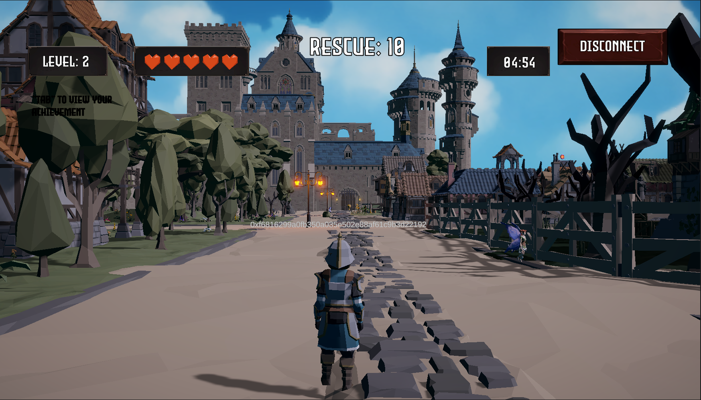

<h1><strong> Planet Giant - Game </strong></h1>
<h2>Cronos & Moralis Hackathon - 09/2022</h2>
  

  

## Note
This game is the main part of the Planet-Giant project - built for the Cronos & Moralis Hackathon - August-September 2022.

The entire project is divided in 3 parts. Here are the links to all the different github repos:

- Unity Game: https://github.com/shamrockstudios/Planet-Giant_Game
- React Webapp:  https://github.com/shamrockstudios/Planet-Giant_Webapp
- Backend contracts: https://github.com/shamrockstudios/Planet-Giant_Contracts

**!! This is the Unity project source code !!**
If you want to download and enjoy the game, Please click the link below:

**Plant-Giant Download: https://drive.google.com/file/d/1p3Ba9BJJSUaR4rrLk4Of7xcVFPJH89-W/view?usp=sharing**

## Description

**The Story**

S A V E   E L D O R A

This was the last distress signal from Planet Choria in year 2852, before the collapse of their governing AI, leading to the auto-release of the Giants.
Eldora, a mystical fairy race native to Planet Choria hold a power unlike any other. It is said that whoever harvests their power can rule the universe.
While all the planets start building their fleets, you take one step ahead.
Because there is no one else who wants to rule the universe more than you.

This is a game where you play the villain.

**Gameplay**

Find all the fairies and collect as many Giant Coins as you can! There is only so much time for you to get to the exit.
But be careful... at every turn the Giants are chasing after you.
Don't get caught! 

**Booster Items**

To help you, you can activate booster items before the game starts. 
These are in the form of NFTs, and you simply scan your wallet at the beginning of the game to activate the boosters.

Try it yourself: [https://main.d2c47nkbs6wp2h.amplifyapp.com/](https://main.d2c47nkbs6wp2h.amplifyapp.com/)

## How to play

**!! Important !!**

**- Please make sure you have a metamask wallet in your phone before starting the game.**

**- Please add Cronos testnet to you wallet: https://chainlist.org/chain/338**

**- Please get some TCRO (is free!) and switch your wallet to Cronos testnet before you claim the rewards!**
**- TCRO: https://cronos.org/faucet**

**!! Important !!**

- After you started the game and chose you charactor, click connect and scan the displayed QR code with your metamask's built-in qr code scanner.

- Control you movement by pressing WASD, Space bar for jump, Shift for running, Tab for achievement menu and Ese for pausing the game.

- When you are standing in the block and giant also near the the block, the giant will start to stepping in the block, which will do damage to you! Run before you got catch!

- Try the collect the giant-coin to unlock a unique charactor.

- After you resued all faires, find you way to the exit asap! It is a shining trophy!

## NFT Rewards

If you are new to this game, remember to keep your metamask open while you playing the game. After finishing the lv1, lv2 and lv3 of the game, we will mint you some ability NFTs.

**!! Open your metamask wallet to receive it !!**

## Built With

- [![unity]][unity-url]
- [![c#]][c#-url]
- [![moralis]][moralis-url]
- [![cronos]][cronos-url]

## Installation

Installation description
If you are interest in enjoy the game, please download the game file below:

Plant-Giant Download: https://drive.google.com/file/d/1p3Ba9BJJSUaR4rrLk4Of7xcVFPJH89-W/view?usp=sharing

If you want to go through the project in Unity and see how it was made, please download this git file and open it with Unity 2021.3.5f1

## Features:

- [x] In-game NFTs booster
- [x] In-game NFTs minting after certain level completion
- [ ] unilimited level amounts
- [ ] In game Marketplace (assassin creed shops like?)
- ...

  

### A BIG THANKS TO MORALIS, CRONOS AND THEIR RESPECTIVE TEAMS !!!

### ⭐️ ...and don't forget to leave a star if you like it! ⭐️

(<a href="#top">back to top</a>)

<!-- MARKDOWN LINKS & IMAGES -->

[unity]: https://img.shields.io/badge/Unity-FFFFFF?style=for-the-badge&logo=Unity&logoColor=61DAFB
[unity-url]: https://unity.com/
[c#]: https://img.shields.io/badge/CSharp-375BD2?style=for-the-badge&logo=CSharp&logoColor=239120
[c#-url]: https://learn.microsoft.com/en-us/dotnet/csharp/
[moralis]: https://img.shields.io/badge/Moralis-green?style=for-the-badge&logo=data:image/png;base64,iVBORw0KGgoAAAANSUhEUgAAADcAAAA2CAYAAABjhwHjAAAAAXNSR0IArs4c6QAAAARnQU1BAACxjwv8YQUAAAAJcEhZcwAADsMAAA7DAcdvqGQAAAhlSURBVGhD3Zn7dxXVFcclD8kLyJPcvAghQEDe9L+pVmVVq9a11FbrskgWSmurtAoKVbBqG2iMrYiPgopiKxDIA5JL3g9IQkIISUggIE/72P3uM+fMnbmz780Qka51f/gssvbMmXU+s/c5s8/ljjt+eJBiFjEYK4jBWEEMxgpiMFYQg7GCGIwVxGCsIAZjBTE4CXH31dD0x9pp1oZzlPGb85T92jXK2XKNsl+9ROm/HaHkJztwzxFxbDjT7qmmpCebaeaGHsrcdEYzpEgr76akJ5oo7l5/z/IgBiMQv+YozXpujLJeuUHZm65D5rqSytl6lXJev0qz37hCs7eBNy9T7h8vU9bmUYp/sF58Vtx9h/Ei+ihv50UwEZkdFynwzjjkT/p+YTZiMJy7D1HqL/op6/ffWmKbIaazlfMHr1TuW99gQuBPlyjw50s0Y32363lp6zoor2Kc8isnKP/dC9GpZCD5lwk8a5xSnm5xPSsqYtDBtLurUX4TlPXyDcra5BBzZmu7LJVXwVkBmFjmywM07d5qytjYS/lVmDAoeO+8xV+jgOv5DI/Rwhkv9Ylz9SAGNdPuOewWM2XI2XrdylYuZwtSuW87pFBKqqQgpd48T4ont/OcNeG/MeNU8L5F4a4I6OsKHqOFWZZfkjRnF2JQM3M91hfEXOvLlOF2iNnZ8mZKSZnsGCEj8sGYxW7NhxEw1839GGuJAjwzbV27OG8bMQiSHj8hZ8xZhna2IMTZkqScQlqk6MNzVPQR+NgwSkWfCJjrfC+whR2iCQ/WivNXSMG4Hx2hzI1XoohBSotZ2YIUi3H5aam8ylGXVEjGmvicv4M9zIjFXgF1zbq3iDHCDtHs10555m8jBZOfQNZ4V4wkpjcNW4x3Pc6WKr9xCuwYhuSIlSUjZQvpiX86QsWfDlPxZ5rPwzBxwPeGhLUsi/KzUQURsycF0399Qe2KEcXMpoFs5VWMqcU9c0MnzfxVJ+VsH6DAziFbys6QETIi+5izNPeLs7g+SJmvtlPSz49Syi8b1d+Fu0+ra8UM7rOF8ULsrGrJjI1dHgeFJ4COwbndO9eYKkWHWMZLvepjHP6MGc+1WpnSUiEhS2bul2D/kCL//T6Ku9/7jHjEsrd12vepMWGiKqOQLKga9IxXhAfi7q+1ynHrNWz3kDO7olljWixzU79rXDhp65rwliHmlOJJfjVEJf9gzmAd9SsJabyhYFcflfzzjLqfxxpRlVEjiRcYt0boXsIDCQ8FrXJkMfMdc24eeuOQMhZOoKI3TAqT5Il+PUjzDgzSjOeD4jgnyU/Vq3tLmK/1eLwcW1JnMvGROu/48ICSM+tMf6DVd8zePC5Q5uYoO5SDtPXHQ1KYGE9y3kFw6DTN+cxnlwHmfnVKjVFjnZImk3iBvFY9Y8MDiQ8HXeXo3EDMrphWPsnH00HxvoGQVPVpKj0MjgzQ7Hf8P6NgV7caw2P5GfMOOSR1ufqXCy9H84HW2/30xxpcY6KR8UqLeutGqrR2gObX9VPy0/JpQaJgd5caMx9jS2tYEi+MJfHCVLkiiylrhTmFBxIearB2x/ByxDpTXQe6gumPH3ONmYzsN1rVpHiC8w7hs/GC/5fDFH7USQuOnaL5R4GS7A9lkssVgqnP+pCLW1MbylpYOXJ/yF1H6tpm1xg/JD5Sg+NKHc6E1eL1aMyv66EFjX20oAGwZD0EIenMYuKjNd6xngAwWXPujnafiJZn1gsdnjHfF0k/q6GFzT20sKmXFh7vpQVBltRZhCSXOWcx4SfC7u0JgPQXB91Ze4+zZvWJ3O7MfsvfbnkryN4WpLK2k1TWCsEWLcmCnEmdxZIDEXZeKZj8VKt7rSFrfLZSDbBuqaSu4vugtK6DFnWeoEXtEGRJFmzWWdSCeVURKkkK8g8ygbf1zwBmremsqbYKHUFa+XHPuFtN5pZjtPhkNy3u7qZFXRCEZBlLchYdghE3KDEI0l/sde2QzqxxTxfY4f8jPBXufPQwLepop7t6u2hxDzCSJosOwYiblBgECQ/UYs2NWSXJ5zI+vqhm2GqEuSvgLl4aeysoOdBMSwY6aEl/J911CrCkIFjwQZs4XiEGNTOe7wptJDjCqKxxl49ejvu6vMoecdx3pfDjRlo61E5Lz7TTkkEIQlIJ9uksakEu0ZRnhJ7SIAYdBCqGXSWpOn3u8tHTcWcgfjy/A4V7GmjZSCtoo6XDwEiehiBnkQV1BksOTPE3FMOdP61H9kYsOUdJqoYYvd3c/Ti2rLk1O2fR3gZaPt5Cy8daaNk5CI5qybPACDpKNGVtlN9PGDEYBnckZpc0JanOZHx0QftT9MkJcZxf4n9cTaX1jbTiQjOtmAD4d/l5SEJUSToFdYkW7/fx46wYFODDp1tOH2G400cblP67qX0aWKysNUgrLjW5uaglnYIoUbUGUZ6pz06SNUYMRiCtHKfrfZDT64278lItx527NGYyAu/W08pvmmjl5eO08ooDxFZcBEYQJWqyl1flc52LwSikPNOILn0gJMdHGfR3OW/efDPNLO4NKplV14K06roGf4cErRI12Stra1HZlp7lQQxOArdeWVvabLk5e05MqduPf6BaZWzVVQjdaKTV/7JY9S3Qglyiyzl7vMlALrVc6P4jIQZ9kvgw/z+dj9qPgpKDyGoIrf5PA/3gv8csQWTQyKnShFzujptsGsTgbWTZqJUlztbqfzcoQUmuaO/NHZAVYvA2krm1llZeRfZ4rbEglyRKVJUlssqbykLspr7XmRMxeJuZ8wV2TBbkDLIU1qASQ9b4MzElMUYM/h8IVNWrElWfBOySy4aDFKj0/yOSiBiMFcRgrCAGYwUxGCuIwVhBDMYKYjBWEIMxwUH6HxxrlAygbl/kAAAAAElFTkSuQmCC
[moralis-url]: https://moralis.io/

[cronos]: https://img.shields.io/badge/Cronos-732335?style=for-the-badge&logo=data:image/png;base64,iVBORw0KGgoAAAANSUhEUgAAAFoAAABdCAYAAAAlrXG6AAAAAXNSR0IArs4c6QAAAARnQU1BAACxjwv8YQUAAAAJcEhZcwAADsMAAA7DAcdvqGQAAASGSURBVHhe7Zu9j01BGMY1/gASpWIThURBQisUOtFQCRUJCZ2Pgs5q6JaGhoSCgkZBQkVIKH2E2qK36x+49ndzJzm5mTvzvnPnvOecve+TPMlm955zd3535pmZ98zdsnX70sjdvh20kR20kR20kR20kR20kR20kR20kR20kR20kR20kR20kR20kR20kR20kR20kR20kR20kQcFesfS3tGNWyujn6u/RydOn4++pq8eDOgzF66MATf19v3H0YFDR6Ov75t7D/rIsZNjoCk9evJs3Ntj1/fFvQUNOABK9XdtfXTp2nL0Xn1wL0GTw4ArEfHCKIjdt0v3CjQT3HQOl4q42bXvYPR9unAvQDOh5XK4VIyOPuR3p6ABcOfegwmS9kQMsWqJ/Q9W7gw0E1dpDq+t/5v8pNPnr987y29z0DS0NIdXf/0Z5zgjYfn2SjHwFy9fm+e3GWgaVprDAAVs7J4vXr2ZvEonRpNlfrcOmobQoFI9fvo82/sYJV++/ZhcoROjyyK/WwVNA0pz+N2HT+o8PXvxanGctL2dbwU0gJh4SkQOAyx2X4lDfpeqre18ddCabfO0AFSrkcQNo6JEIb9j9y11ddAlYkJraxXA6GKUlEgbXSl3CpoJTNMYejsjhh6nLSBdvn5Tnd+DB02DtTkcKzRpC0h8UHfvP5xcndegQdNQTQ5LCk3aDQirC0l+Dxa05vET4LQbHO0GJNe7Bwta8o8Dap5CE/Ei3YDkloGbFrS00CTZBTIacu+3cKD5vaTQRK6G3Zt0F8gqZVZ+Lxzo3MQUqnbT1xEzKVi51Y2DnghQwMhNcPTY6Sqe5DoHvaGS3SL3l1T7gh30hmo2cpYd9IYcdMYpOeiKTslBV3RKDrqiU3LQFZ2Sg67olBx0RaekAa2pwmF2geHpi/R5n4NuSHKMq/Tpy8KBlpw2ij1F4X65qh/l0lk1j4UDnavCNUXvlR7znVX1C1440MGxKlyJQtUv9h5NLyzoYF5XepaO6l2uPBq8aUHzLDB2zSxrztIxoWrAMHpy8TNY0IjJS/M0nN6ZelqtPavH/WKrlJgGDTqI3qQ5vUkPbC4DpU9fmmZdLnk2GbQpQAcRJxpYNF7zFAVzjWSVMq1NBRoxjNv4MiYf4DynW2uel64OmvwtPb0p2c1JLc3hmIgozYiRuDroYPJTumKYFsO8tKF80JocbooOUjMumm4NNAYWeVoqeqU0v6W7xZjoEBzrjd23llsFHUwvSRWOUmL4p6p4fBDznNXTbHDmsQnoYNa7pfkdq+LN86VQPviak13OpqAxvSe39U2JKt7xU+fmymHNhqmWzUEHk981CkhSSQtNbbkz0MHEQWkBSSrtBqcNdw46WFNAkkpbaGrTvQGNyW/Nl3lmSVtosnCvQAczzEuXg9pCk5V7CTqYYS9dDpYc87V0r0EHp76Mqf1SaFceBGhMHDS38xbb5poeDOjg3fsPjye6bTv3RP/eVw8O9FDtoI3soI3soI3soI3soI3soI3soI3soI3soI3soI3soI3soI3soI3soE28NPoPFGo9yDe53c8AAAAASUVORK5CYII=
[cronos-url]: https://cronos.org/
